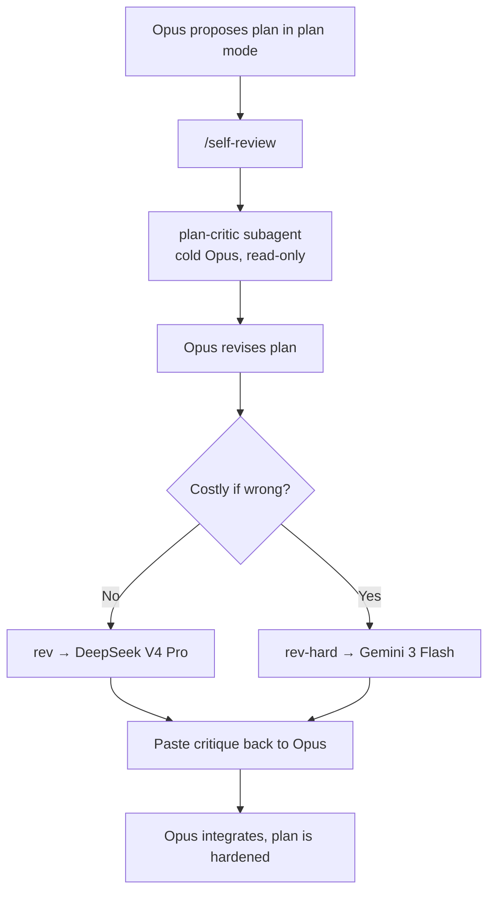

# Two-Stage Plan Review

A pipeline that pressure-tests engineering plans **before** implementation, using two independent critics: one in-family (cheap, catches internal gaps) and one cross-lineage (catches the blind spots Claude can't see in itself).

> [!abstract] One-line mental model
> Stage 1 is the cheap in-house filter. Stage 2 is the real lineage diversity. Keep both, **in that order**.

## How it works



### Stage 1 — self-review (in-house, free, fast)

- **Trigger:** type `/self-review` after Opus proposes a plan.
- **What runs:** the [[#plan-critic|plan-critic]] subagent — Opus, read-only, prompted as a hostile reviewer with _no loyalty_ to the plan. It runs in a **fresh context window**, so it isn't anchored by the reasoning that produced the plan.
- **Output:** assumptions → internal inconsistencies → blind spots → over-engineering → verdict. Opus then revises in place and shows ==only what changed==.

### Stage 2 — cross-lineage (different model family, costs OpenRouter credits)

- **Trigger:** copy the revised plan, then run `rev` in the terminal.
- **What runs:** `pbpaste | llm -t peer-review` ships the clipboard plan to **DeepSeek V4 Pro** via the `llm` CLI + OpenRouter plugin. A different lineage catches assumptions Claude shares with itself.
- **Escalation:** `rev-hard` swaps in **Gemini 3 Flash** — use when a missed assumption would be expensive.

## Daily ritual

> [!tip] The loop
>
> 1. Opus proposes a plan in plan mode.
> 2. Type `/self-review` → plan-critic critiques it cold, Opus revises.
> 3. Copy the revised plan → run `rev` in the terminal for the DeepSeek pass.
> 4. Use `rev-hard` instead when a missed assumption would be costly.
> 5. Paste anything new back to Opus.

## Commands & aliases

| Command        | Where       | What it does                                     |
| -------------- | ----------- | ------------------------------------------------ |
| `/self-review` | Claude Code | Stage 1 — dispatch plan-critic, then revise      |
| `rev`          | terminal    | Stage 2 — clipboard plan → DeepSeek V4 Pro       |
| `rev-hard`     | terminal    | Stage 2 (hard) — clipboard plan → Gemini 3 Flash |

```bash
# ~/.zshrc
alias rev='pbpaste | llm -t peer-review'
alias rev-hard='pbpaste | llm -t peer-review -m openrouter/google/gemini-3-flash-preview'
```

> [!warning] Aliases need a fresh shell
> Run `source ~/.zshrc` or open a new terminal tab before `rev` resolves.

## What lives where

> [!info] Tracked vs. out-of-repo
> The agent and command are **version-controlled** in `agent-config` and symlinked into `~/.claude`. The shell/CLI pieces live outside any repo.

| Piece                      | Location                                                                    | Tracked?         |
| -------------------------- | --------------------------------------------------------------------------- | ---------------- |
| `plan-critic` agent        | `agent-config/agents/plan-critic.md` → `~/.claude/agents/`                  | ✅ git + symlink |
| `/self-review` skill       | `agent-config/skills/self-review/SKILL.md` → `~/.claude/skills/`            | ✅ git + symlink |
| `peer-review` template     | `~/Library/Application Support/io.datasette.llm/templates/peer-review.yaml` | ❌               |
| `rev` / `rev-hard` aliases | `~/.zshrc`                                                                  | ❌               |
| OpenRouter API key         | `llm` keystore                                                              | ❌ (secret)      |

> [!note] Why a skill, not a command file
> This repo has no `commands/` directory — its mechanism for a slash command is a `user-invocable: true` skill. `/self-review` is functionally identical to a command file.

## plan-critic

The Stage 1 critic. Read-only (`Read, Grep, Glob`) so it can inspect the codebase to ground its critique but **cannot edit** — it reviews, it doesn't implement. It outputs exactly five sections:

1. Unstated assumptions, and what breaks if each is false.
2. Internal inconsistencies.
3. Blind spots (auth, race conditions, migration/rollback, error handling, idempotency, tests, data loss, observability).
4. Over-engineering — with the simpler version.
5. Verdict: ship / fix / rethink, then the top three changes.

## peer-review template (Stage 2 prompt)

```yaml
model: openrouter/deepseek/deepseek-v4-pro
system: |
  Adversarially review this engineering plan, written by a different AI.
  Find what it missed. Do not praise or restate it.

  1. Unstated assumptions, and what breaks if each is false.
  2. Blind spots that genuinely apply: auth, race conditions, migration and
     rollback safety, error handling, tests, data loss.
  3. Over-engineering. Give the simpler version.
  4. Steelman one different approach. When does it win?
  5. Verdict: ship / fix / rethink, then the top three changes.

  Terse. No filler. If a section has nothing real, write "none".
```

## Design rationale

> [!question] Why this order, and why two models?
>
> - **Cheap-first.** Stage 1 runs every time at no marginal cost; Stage 2 spends OpenRouter credits, so it only runs on plans Stage 1 has already tightened.
> - **Lineage diversity.** Claude reviewing Claude shares the same blind spots. A different model family (DeepSeek, Gemini) is the point — it sees what self-review structurally cannot.
> - **Fresh context.** plan-critic reviews cold, with no loyalty to the plan's original reasoning.

## Setup notes

> [!todo] First-run / new-machine checklist
>
> - [ ] `pipx install llm` and inject `llm-openrouter`
> - [ ] `llm keys set openrouter` (paste key)
> - [ ] Write `peer-review.yaml` to the `llm` templates dir
> - [ ] Add `rev` / `rev-hard` to `~/.zshrc`, then `source` it
> - [ ] `./install.sh` in `agent-config` to symlink agent + skill
> - [ ] Restart Claude Code so `plan-critic` and `/self-review` load
> - [ ] Smoke test: `echo "Plan: ..." | llm -t peer-review`

On **Linux** there is no `pbpaste` — install `wl-clipboard` or `xclip` and swap `pbpaste` for `wl-paste` or `xclip -selection clipboard -o` in the aliases.

## Related

- [[Claude Code]]
- [[agent-config]]
- [[Plan Mode]]
