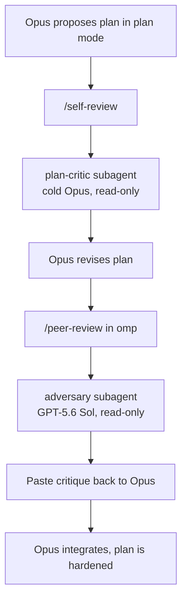

# Two-Stage Plan Review

A pipeline that pressure-tests engineering plans **before** implementation, using two independent critics: one in-family (cheap, catches internal gaps) and one cross-lineage (catches the blind spots Claude can't see in itself).

> [!abstract] One-line mental model
> Stage 1 is the cheap in-house filter. Stage 2 is the real lineage diversity. Keep both, **in that order**.

## How it works

### Stage 1 — self-review (in-house, free, fast)

- **Trigger:** type `/self-review` after Opus proposes a plan.
- **What runs:** the [[#plan-critic|plan-critic]] subagent — Opus, read-only, prompted as a hostile reviewer with _no loyalty_ to the plan. It runs in a **fresh context window**, so it isn't anchored by the reasoning that produced the plan.
- **Output:** assumptions → internal inconsistencies → blind spots → over-engineering → verdict. Opus then revises in place and shows ==only what changed==.

### Stage 2 — cross-lineage (different model family, on the $10 OpenCode Go plan)

- **Trigger:** open `omp` on the plan file and run `/peer-review`.
- **What runs:** the `adversary` subagent (`omp/agents/adversary.md`), read-only, pinned to `model: "@adversary"`. That role resolves to **GLM-5.3-Flash at max effort** on OpenCode Go. It has its own exact-model chain in `retry.fallbackChains` (`opencode-go/glm-5.3-flash`), and both rungs are non-Anthropic: zen DeepSeek V4 Flash, then Go Muse Spark.
- **What happens when both rungs are quota-blocked:** the chain is exhausted, omp falls to the `default` chain, and the critique runs on Sonnet. Verified 2026-08-30: with the OpenCode workspace at its $10 monthly limit, an adversary run landed on `claude-sonnet-5`. Chain config alone cannot prevent this, because the terminal fallback must be a provider that works. **When that happens, stage 2 has silently degraded into a second stage 1** — same lineage, no independent view. Check with `omp usage`; if OpenCode monthly reads 100%, re-run `/peer-review` after the window resets rather than trusting the verdict.
- **Why not Codex any more:** Sol held this slot until 2026-08-30, when the Codex Pro 5x subscription was dropped. Sol was the better critic, but it cost $100/month and sat at roughly 37% weekly utilisation, and ChatGPT Plus at $20 caps Sol at 10–100 messages per 5-hour window — far below the 2,805 Sol calls the previous week. GLM-5.3-Flash is Z.ai, so cross-lineage against a Claude-written plan survives the move.
- **Why GLM-5.3-Flash and not Muse Spark:** the `reviewer` agent runs Muse Spark. Splitting the two stages across families means one provider outage cannot take out both, and a plan critique is low volume, so $0.075/$0.25 per Mtok is cents per run.
- **Cost:** none beyond the $10 Go subscription. Earlier occupants: DeepSeek V4 Pro (accurate but slow enough that the review got skipped), Gemini 3.7 Flash on OpenRouter, MiniMax M3 on Go, then GPT-5.6 Sol on Codex. OpenRouter is no longer referenced by any role.

## Daily ritual

> [!tip] The loop
>
> 1. Opus proposes a plan in plan mode.
> 2. Type `/self-review` → plan-critic critiques it cold, Opus revises.
> 3. Open the plan in `omp`, run `/peer-review` → the `adversary` subagent critiques it on GPT-5.6 Sol.
> 4. Paste anything new back to Opus.

## Commands & aliases

- `/self-review` — Claude Code. Stage 1 — dispatch plan-critic, then revise.
- `/peer-review` — omp. Stage 2 — dispatch the `adversary` subagent.

> [!note] The `rev` / `rev-hard` aliases are gone
> Until 2026-08-15 Stage 2 ran as `pbpaste | llm -t peer-review` against an
> untracked `llm` template. That was a third copy of the same prompt picking a
> model a third way. Both aliases and the template were deleted; the subagent is
> the single tracked path.

## What lives where

> [!info] All tracked
> Every piece of this pipeline is now version-controlled in `agent-config` and symlinked into place by `./install.sh`. Only the API key lives outside the repo.

- `plan-critic` agent — `agent-config/agents/plan-critic.md` → `~/.claude/agents/`. Tracked: ✅ git + symlink.
- `/self-review` skill — `agent-config/skills/self-review/SKILL.md` → `~/.claude/skills/`. Tracked: ✅ git + symlink.
- `peer-review` skill — `agent-config/skills/peer-review/SKILL.md` → `~/.agents/skills/`. Tracked: ✅ git + symlink.
- `adversary` agent — `agent-config/omp/agents/adversary.md` → `~/.omp/agent/agents/`. Tracked: ✅ git + symlink.
- `adversary` model role — `agent-config/omp/config.yml` → `~/.omp/agent/config.yml`. Tracked: ✅ git + symlink.
- Anthropic + Codex credentials — omp auth broker, not the plain auth store (`~/.local/share/opencode/auth.json` does not list Anthropic). Tracked: ❌ (secret)

> [!note] Why a skill, not a command file
> This repo has no `commands/` directory — its mechanism for a slash command is a `user-invocable: true` skill. `/self-review` is functionally identical to a command file.

## plan-critic

The Stage 1 critic. Read-only (`Read, Grep, Glob`) so it can inspect the codebase to ground its critique but **cannot edit** — it reviews, it doesn't implement. It outputs exactly five sections:

1. Unstated assumptions, and what breaks if each is false.
2. Internal inconsistencies.
3. Blind spots (auth, race conditions, migration/rollback, error handling, idempotency, tests, data loss, observability).
4. Over-engineering — with the simpler version.
5. Verdict: ship / fix / rethink, then the top three changes.

## adversary (Stage 2 critic)

`omp/agents/adversary.md`. Read-only (`read, grep, glob`), so it can check the
plan's claims against the real code — stale anchors are themselves a finding —
but cannot edit. It outputs the same five sections as plan-critic, with a
steelmanned alternative in place of internal inconsistencies.

> [!warning] Anchors are checked with grep, not read
> Without the edit tool in the session, omp's `read` returns no line numbers
> (hashline numbering needs `edit.mode: hashline` plus `edit`; the fallback,
> `readLineNumbers`, is off). `grep` does return line numbers, so the prompt
> tells the adversary to verify a cited `file:line` by grepping the symbol
> there. Turning `readLineNumbers` on globally would buy the same check at a
> token cost on every read in every session.

Its frontmatter pins `model: "@adversary"` rather than a selector. That is the
whole trick: the model lives in one place (`omp/config.yml`), so changing the
cross-lineage reviewer is a one-line edit and the fallback chain follows it.

## Design rationale

> [!question] Why this order, and why two models?
>
> - **Cheap-first.** Stage 1 runs every time at no marginal cost; Stage 2 spends Codex quota, so it only runs on plans Stage 1 has already tightened.
> - **Lineage diversity.** Claude reviewing Claude shares the same blind spots. A different model family is the point — it sees what self-review structurally cannot. This is why no `anthropic/` selector appears in the `openai-codex/*` fallback chain: a rung back onto Claude would undo Stage 2. Note the scope — that one chain, not the whole file. Anthropic rungs appear elsewhere in `retry.fallbackChains` by design, because Claude directs the judgment roles again.
> - **Fast enough to actually run.** A reviewer you wait three minutes on is a reviewer you skip. Speed is a correctness property here, not a comfort.
> - **Fresh context.** plan-critic reviews cold, with no loyalty to the plan's original reasoning.

## Setup notes

> [!todo] First-run / new-machine checklist
>
> - [ ] `omp usage` shows both an Anthropic and a Codex account — the `default` and `adversary` roles need them
> - [ ] `./install.sh` in `agent-config` to symlink the agents, skills, and omp config
> - [ ] Restart Claude Code so `plan-critic` and `/self-review` load
> - [ ] Smoke test Stage 1: `/self-review` on any plan
> - [ ] Smoke test Stage 2: `omp --model gpt-5.6-sol -p "reply OK"`

## Related

- [[Claude Code]]
- [[agent-config]]
- [[Plan Mode]]
